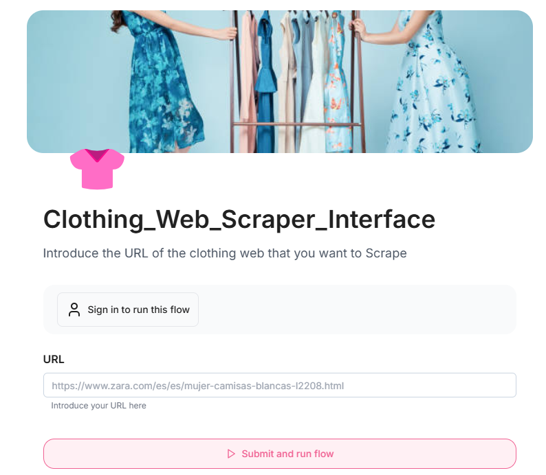
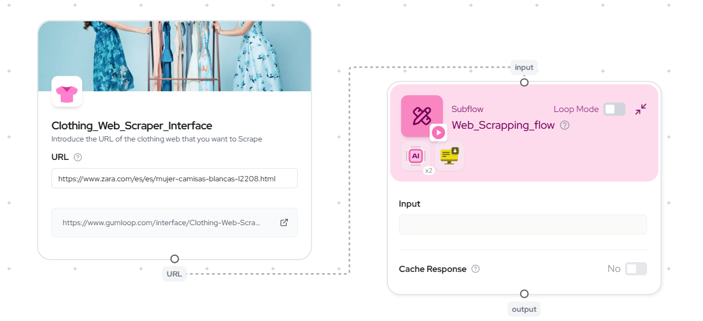
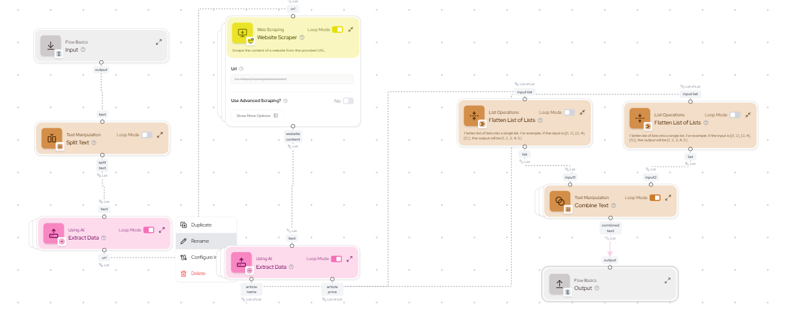

# Gumloop Automation Interface: Web Scraping and Price Comparison

This project demonstrates how to create an interface for the previous automate web scraping and price comparison tasks using Gumloop. The automation scrapes online clothing store prices and processes the data to generate useful insights.

## Project Overview
- Tool Used: Gumloop
- Features: Web scraping interface, data processing, price comparison
- Live Project: [Gumloop Interface](https://www.gumloop.com/interface/Clothing-Web-Scraper-Interface-rpvpvwZUX2tTLdLK7UMZn1)

## Requirements
- Gumloop account (free trial available)
- Internet connection

## Screenshots
Here are some screenshots showing the automation flow:

## Setup and Usage
1. Clone this repository.
2. Follow the instructions in the live pipeline link to understand how the automation is built and its components.
3. Refer to the README file for any additional customizations you may need to make.

## Contributing
If you'd like to contribute, feel free to fork the repo and make your improvements.
